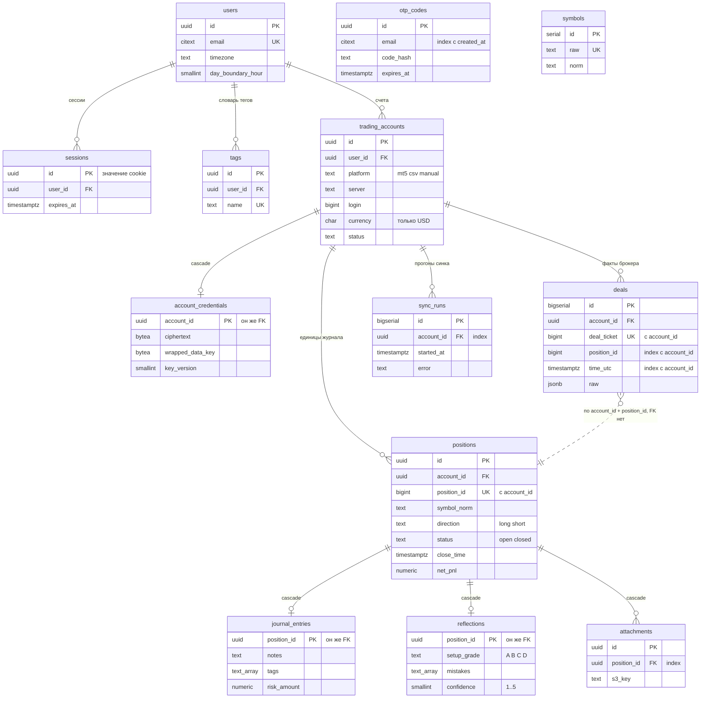

# ARCHITECTURE — as-built

Updated: 2026-09-05

Этот документ описывает **то, что реально построено**. Проектное намерение живёт в `SPEC.md` и здесь не дублируется.

Статусы задач здесь не ведутся — они в `docs/tickets/BOARD.md`. В таблицу ниже задача попадает, когда её код влит в `main`.

---

## Что построено

| Задача | Что даёт |
|---|---|
| `S0-01` | структура монорепо, линтеры, `make ci`, GitHub Actions |
| `S0-02` | `app/core` (config, db, redis, logging со скрабом секретов, errors), `domains/system` с `/health` и `/version`, Alembic без ревизий, guard тестовой БД, env-guard прода. Скраб доведён в `X-02` |
| `S0-03` | модель данных: 13 таблиц одной ревизией `b07a46275bbc`, UUID v7, ER-диаграмма ниже |
| `S0-04` | вход по одноразовому коду: `POST /auth/request-code`, `/auth/verify`, `/auth/logout`, `GET /auth/me`, сессия в cookie (`domains/auth/cookies.py`), rate-limit (`core/rate_limit.py`). Почты нет — письмо с кодом кладётся в `dev_outbox` и читается через `GET /dev/outbox` (ревизия `8f4c1d90ae27`) |
| `S0-05` | envelope-шифрование паролей брокерских счетов (`core/security.py`) и ротация мастер-ключа (`core/key_rotation.py`); `key_version` — отпечаток ключа, а не счётчик (ADR-0003) |
| `S0-06` | `docker-compose.yml` с профилями `local` и `prod`, `make init`/`up`/`down`, скрипты `infra/scripts` (`init-env.sh`, `start`, `stop`), Caddy в профиле `prod`, доверенный прокси (`core/client_ip.py`) |
| `S0-07` | веб-скелет: роутер `src/routes/routes.tsx`, экран входа, тёмная тема, генерация типов из OpenAPI (`make types`) |
| `S0-08` | настройки профиля: `GET`/`PATCH /users/me`, `GET /users/timezones`, экран настроек во фронте |

Ещё не существует: ингест и сборщик позиций (этап 1), журнал и аналитика (этап 2), коллектор MT5 (`apps/collector-mt5` — пакет-заглушка), прод.

Разделы про repo map, слои API, auth-флоу, схему шифрования и структуру фронта пока не написаны — их место в «Порядке заполнения» ниже, и они не заполнены задним числом намеренно: `DEVELOPER_MANUAL.md` §10.2 требует писать сюда проверенное, а не восстановленное по памяти.

Проектное намерение по всем темам — `SPEC.md`:

| Тема | Раздел SPEC |
|---|---|
| Схема системы и компоненты | §1 |
| Структура монорепо | §2.1 |
| Модель данных (DDL-эскиз) | §3 |
| Auth и сессии | §4 |
| HTTP API | §5 |
| Нормализация deals из MT5 | §6 |
| Сборщик позиций | §7 |
| Коллектор MT5 | §8 |
| Фронтенд: маршруты и экраны | §9 |
| Фоновые задачи (arq) | §10 |
| Инфраструктура и запуск | §11 |

---

## Порядок заполнения

Документ наполняется по мере появления кода, отдельным `docs:`-коммитом после мержа соответствующей задачи:

| После задачи | Что появляется здесь | Состояние раздела |
|---|---|---|
| `S0-01` | repo map: что реально лежит в `apps/`, `packages/`, `infra/` | **не заполнено** |
| `S0-02` | точка входа API, слои, обработка ошибок, логирование | **не заполнено** |
| `S0-03` | модель данных как построена | ✅ ER-диаграмма и таблица расхождений ниже |
| `S0-04` | auth-флоу как построен: TTL, rate-limit, cookie, dev-outbox вместо почты | **не заполнено** |
| `S0-05` | схема шифрования credentials, версионирование ключа | **не заполнено**, частично закрыто ADR-0003 |
| `S0-06` | профили compose, что поднимается в каждом, где живут данные | **не заполнено** |
| `S0-07` | структура фронта: роутер, провайдеры, генерация типов | **не заполнено** |
| `S0-08` | как считается и хранится профиль: таймзона, граница дня | **не заполнено** |
| `S1-02`, `S1-03` | нормализатор и сборщик позиций: инварианты, «что молча ломает» | код не написан |
| `S1-08` | коллектор: процессная модель, что происходит при обрыве | код не написан |

Долг по незаполненным разделам реален и растёт: восемь задач влито, разобран один. Каждый следующий раздел пишется по прогону, а не по памяти — поэтому дешевле писать его сразу после мержа своей задачи, чем догонять пачкой.

Обязательный раздел, который заводится вместе с первым кодом: **«Что молча ломает флоу X»** — неочевидные связи, из-за которых изменение в одном месте тихо ломает другое. Это самая ценная часть as-built-документации и главная защита следующей сессии.

---

## Источник истины по схеме БД

После создания Alembic-миграций источник истины по типам и ограничениям — **миграции**, а не DDL-эскиз в `SPEC.md` §3 (так сказано в самом `SPEC.md` §3). Расхождение эскиза и миграции фиксируется здесь.

---

## Модель данных (после `S0-03`)

Ядро схемы — 13 таблиц — создаётся одной ревизией `b07a46275bbc` (`apps/api/alembic/versions/b07a46275bbc_core_schema.py`). Модели живут в `apps/api/app/domains/<домен>/models.py` и вместе с миграцией сверяются тестом `apps/api/tests/integration/test_core_schema.py`: он читает `information_schema` и системные каталоги, а не модели.

Дальше ревизия `8f4c1d90ae27` (`S0-04`) добавила четырнадцатую таблицу `dev_outbox` — почты нет, письма с кодами складываются туда — и индексы `ix_sessions_user_id`, `ix_trading_accounts_user_id`. Диаграмма и разбор ниже описывают **ядро**: `dev_outbox` в них не входит — у неё только PK, внешних ключей нет ни в одну сторону, наполняет её единственный писатель `ConsoleEmailProvider`.

`daily_stats` здесь нет — она создаётся в `S2-05`.

### ER-диаграмма

### Что молча ломает флоу «пересборка позиций»

- **`unique (account_id, position_id)` на `positions`** — единственная опора UPSERT'а пересборки. Пересборка обязана обновлять строку по этому ключу, а не удалять и вставлять заново: `positions.id` — родитель `journal_entries`, `reflections`, `attachments` с `on delete cascade`. `DELETE` вместо `UPDATE` тихо унесёт весь пользовательский слой.
- **`unique (account_id, deal_ticket)` на `deals`** — на нём стоит идемпотентность `POST /ingest/deals`. Без него повторная отправка того же батча удвоит сделки, и пересборка честно посчитает удвоенный P&L.
- **`uq_trading_accounts_mt5_identity` — частичный индекс** (`where platform = 'mt5'`). У `csv` и `manual` `server` и `login` произвольны и повторяются; сделать индекс полным — значит запретить второй ручной счёт с теми же полями.
- **Каскадов ровно четыре**: `account_credentials → trading_accounts` и `journal_entries` / `reflections` / `attachments` → `positions`. Остальные FK — `NO ACTION`: удаление пользователя или счёта с данными падает громко, а не вычищает журнал молча.
- **UUID v7 генерирует приложение**, не БД: в Postgres 16 нет `uuidv7()`, а в stdlib Python 3.12 нет `uuid.uuid7()`. Генератор — `apps/api/app/core/ids.py`, значение по умолчанию стоит в модели (`default=uuid7`), поэтому `INSERT` в обход ORM обязан задавать `id` сам.
- **Имена ограничений заданы конвенцией** `NAMING_CONVENTION` в `apps/api/app/core/db.py`. Новая модель без неё получит имя от Postgres, и `downgrade` следующей задачи придётся писать по факту, а не по модели.

### Расхождения с `SPEC.md` §3

| Место | В `SPEC.md` | В миграции | Почему |
|---|---|---|---|
| `attachments.position_id`, `tags.user_id`, `sync_runs.account_id` | без `not null` | `not null` | во всех трёх строка без владельца бессмысленна, а `unique (user_id, name)` на `NULL` не работает. Ослабить `not null` потом — одна строка миграции, ужесточить — backfill |
| `index (email, created_at desc)` на `otp_codes` | с `desc` | без `desc` | btree сканируется в обе стороны, для `where email = … order by created_at desc limit 1` разницы нет. Колоночный индекс сравним с отражением схемы, выражение — нет |
| `sessions.id` | `uuid pk` | `uuid pk`, без `default` | значение cookie: v7 раскрывает время создания и оставляет 62 бита случайности. Генератор выбирает `S0-04` |
| `attachments.position_id`, `sync_runs.account_id` | индексов нет | `ix_attachments_position_id`, `ix_sync_runs_account_id` | `attachments` — единственная дочерняя таблица `positions`, где `position_id` не PK: без индекса каждый `delete from positions` проверяет каскад сиквенс-сканом, и «скриншоты этой позиции» в `S2-02` читаются так же. `sync_runs` по определению читается как «прогоны этого счёта». Индексов на `sessions.user_id`, `tags.user_id`, `trading_accounts.user_id` в этой ревизии нет намеренно — они приходят вместе с запросами: `sessions` и `trading_accounts` получили свои в `8f4c1d90ae27` (`S0-04`), у `tags.user_id` индекса по-прежнему нет — запросов к нему пока никто не пишет |
| `daily_stats` | описана в §3.4 | не создаётся | `SPEC.md` §12: таблица заводится в `S2-05` |
